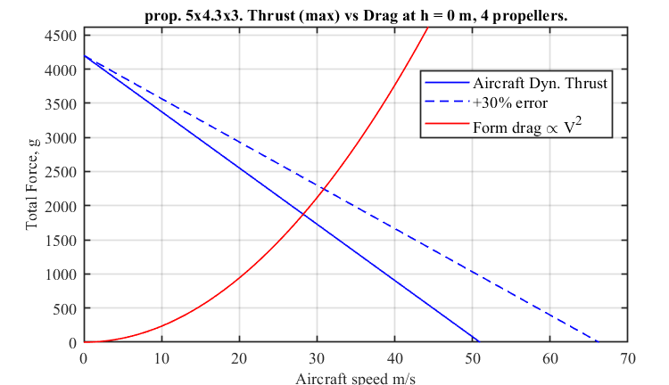

# ALPHA motors 
Database of tested motors, performance information and dynamic thrust approximations for the [ALPHA project](https://www.kthaero.com/alpha), KTH.

## Motor-Propeller Database

The data is stored in a `struct` object, each index (entry) corresponds to a propeller. The required data is:

1. Name or label
2. Propeller radius (metres)
3. Propeller pitch (metres)
4. Maximum RPS (revolutions per second)
5. Throttle vector (-100 to +100 format)
6. Power vector (Watts)
7. Thrust vector (grams)

The easiest is to copy the previous entry and change with the new values accordingly. The calculations will be applied to each entry of the data base.

## Dynamic Thrust Approximation

An attempt was made to approximate the dynamic thrust by analytical methods, which proved to be very inaccurate compared to experimental data in wind tunnels of similar propellers. Instead an experimental correction factor was used, as presented [by Gabriel Staples' blog](https://www.flitetest.com/articles/propeller-static-dynamic-thrust-calculation) with some sight modifications. Details on the method can be found in file [thrust approx pdf](thrust_approx.pdf).

The input parameters for `dynamic_thrust_1.m` are:

1. Altitude $h$, (geometric). This is used with an ISA atmosphere model to calculate $\rho$
2. Number of motors `n_motors`
3. Drag coefficient `CD = 0.0314` as of the current half scale design
4. Drag reference area `S_wing`
5. Propeller index to plot `prop_i`

The script `dynamic_thrust_1.m` calculates dynamic thrust for each throttle level added in the data base entry for each propeller in the data base. The plots are only performed on the motor-propeller pair chosen but this could be easily changed if comparison of propellers required.

### Results, half scale, 5x4.3x3 propeller

For the current half scale design and motors (Emax ECO II Series 2207 2400KV, prop 5x4.3x3) at full throttle, the predicted dynamic thrust and form drag is plotted below. the intersection of thrust and drag represents the maximal theoretical speed.

V~max~ = 30 m/s = 108 km/h

The zero-thrust speed is approximately:

V~T=0~ = 51 +- 15.3 m/s

